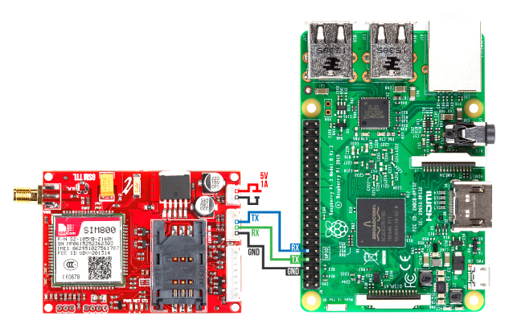

# Raspberry Pi sim800l gsm module
- connecting the raspberry pi to sim8ool gsm module to send, receive sms, delete sms etc.

>> SIM900/SIM800 are 2G only modems, make sure your provider supports 2G as it is already being phased out in a lot of areas around the world, else a 3G/4G modem like the SIM7100 / SIM5300 is warranted.  

##  Requirements
- Raspberry pi 3 with Raspbian OS installed.
- Sim800L GSM module
- external power supply for the Sim800L (5v 1A worked for our case, use the correct one for your module)
- A bunch of jumper wires.

## References
- https://github.com/vshymanskyy/TinyGSM
- https://lastminuteengineers.com/sim800l-gsm-module-arduino-tutorial/
- [AT Datasheet](https://www.elecrow.com/wiki/images/2/20/SIM800_Series_AT_Command_Manual_V1.09.pdf)

## setup
### Hardware connection



### Disable serial console
We will start by disabling serial console to enable communication between the pi and sim800l via serial0 .

Open the terminal on your pi and run `sudo raspi-config` 
Select Interfaces → Serial 
Select No to the 1st prompt and Yes for the 2nd.


## Usage examples

```python 
from sim800l import SIM800L
sim800l=SIM800L('/dev/serial0')
```
#### send sms
```python
sms="Hello there"
#sim800l.send_sms(dest.no,sms)
sim800l.send_sms('2547xxxxxxxx',sms)
```
#### read sms
```python
#sim800l.read_sms(id)
sim800l.read_sms(id)
```

#### callback action
```python
def print_delete():
    #assuming the sim has no sms initially
    sms=sim800l.read_sms(1)
    print(sms)
    sim800l.delete_sms(1)

sim800l.callback_msg(print_delete)

while True:
    sim800l.check_incoming()
```
